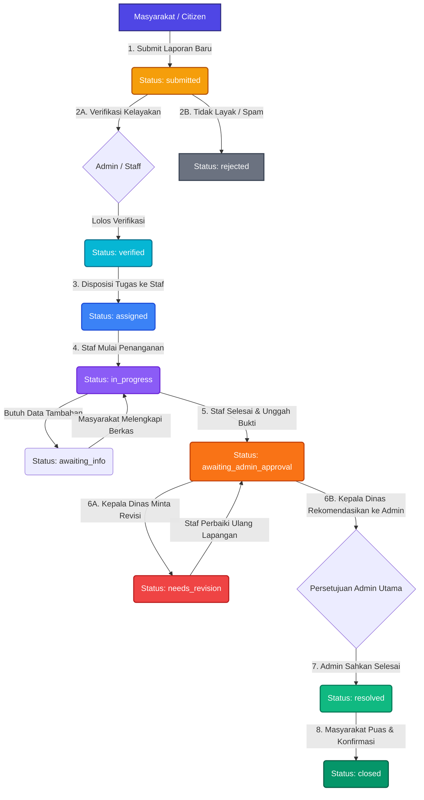
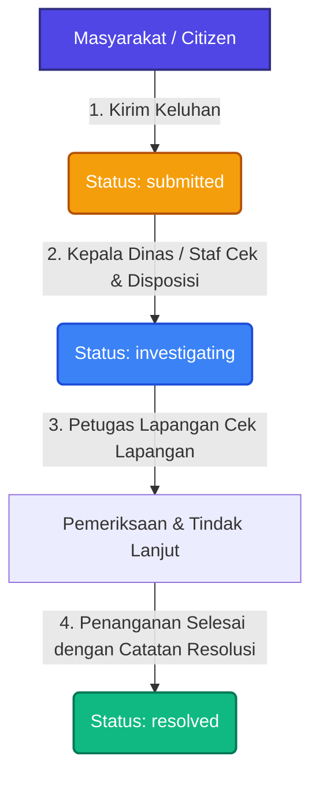
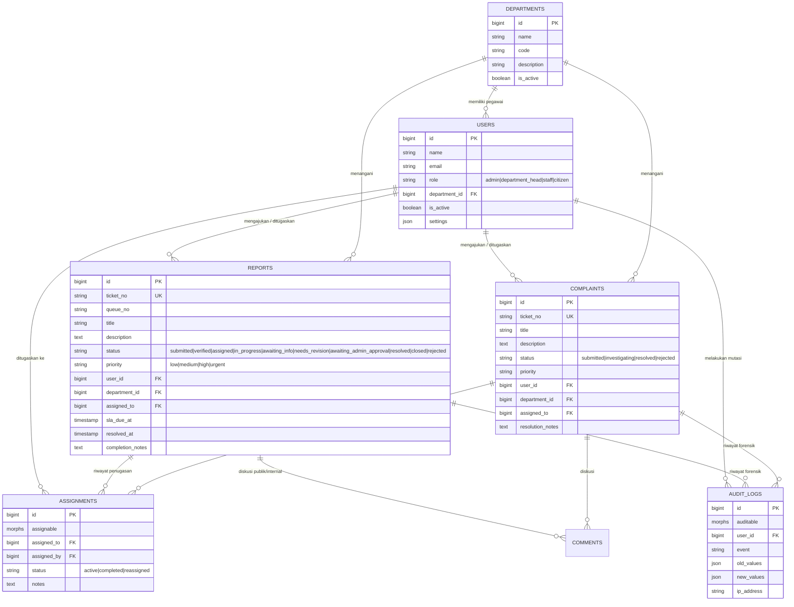

# ⚡ SynapseGov — Intelligent e-Government Public Report & Complaint System
### *Sistem Terpadu Penanganan Laporan & Aspirasi Masyarakat Berbasis e-Government dengan Penegakan SLA dan Isolasi Keamanan Multi-OPD*

[](https://laravel.com)
[](https://php.net)
[](#-arsitektur--alur-kerja-workflow-lifecycle)
[](#1-⏱️-automated-service-level-agreement-sla-engine)
[](#-fitur-unggulan--inovasi-teknologi)
[](LICENSE)

---

## 📌 Ringkasan Proyek

**SynapseGov** adalah platform tata kelola pemerintahan digital (*e-Government*) modern yang mentransformasikan penanganan laporan pengaduan infrastruktur, fasilitas umum, dan aspirasi pelayanan masyarakat secara terstruktur, transparan, akuntabel, dan terikat waktu (*Service Level Agreement / SLA-enforced*).

Dikembangkan secara khusus untuk **Lomba Web Development IT Days 2026 - Himpunan Mahasiswa Informatika (HMIF) Universitas Sanata Dharma** pada subtema **Pemerintahan Digital (*e-Government*)** dengan mengusung filosofi tema *"Mens et Corpus"* (keseimbangan antara kecerdasan logika otomasi sistem dan ketangguhan arsitektur keamanan data).

Aplikasi ini mengatasi kendala laten birokrasi pemerintahan konvensional: laporan yang terabaikan tanpa kepastian waktu, disposisi manual yang lambat, kerentanan kebocoran catatan rahasia internal ke publik, serta tumpang tindih kewenangan antar Organisasi Perangkat Daerah (OPD).

---

## 👥 Matriks Akun Demo untuk Pengujian Juri

Aplikasi telah dilengkapi seeder data realistis yang mencakup hierarki 4 peran (*Multi-Role Hierarchy*). Juri dan penguji dapat langsung masuk menggunakan akun-akun berikut:

| Peran (*Role*) | Email Akun | Kata Sandi (*Password*) | Lingkup Wewenang & Hak Akses |
|:---|:---|:---|:---|
| **Super Admin** | `admingg@gmail.com`<br>*(alt: `admin@government.gov`)* | `password`<br>*(alt: `admin123`)* | **Kontrol penuh sistem global**: memverifikasi kelayakan awal tiket masuk, menolak laporan spam/invalid, mengelola departemen/OPD, memantau analitik SLA kota, audit log forensik, dan memberikan persetujuan penyelesaian akhir (*close approval*). |
| **Kepala Dinas (*Dept Head*)** | `departhead@gmail.com`<br>*(alt: `head.pw@government.gov`)* | `password`<br>*(alt: `head123`)* | **Pimpinan Operasional OPD**: mengelola antrean tiket dinas terkait, mendisposisikan (*assign/reassign*) tiket ke staf lapangan, menginstruksikan revisi jika hasil kerja staf belum tuntas (`needs_revision`), merekomendasikan tiket selesai ke Admin, dan menyelesaikan keluhan masyarakat. |
| **Petugas Lapangan (*Staff*)** | `staff@gmail.com`<br>*(alt: `staff1.pw@government.gov`)* | `password`<br>*(alt: `staff123`)* | **Pelaksana Teknis Lapangan**: menerima disposisi tugas, mengubah status pengerjaan (`in_progress`), meminta data tambahan warga (`awaiting_info`), mengunggah bukti penyelesaian lapangan, dan mengajukan laporan selesai ke pimpinan. |
| **Masyarakat (*Citizen*)** | `usergg@gmail.com`<br>*(alt: `citizen1@example.com`)* | `password`<br>*(alt: `citizen123`)* | **Masyarakat Pelapor**: mengajukan laporan kerusakan fasilitas & keluhan pelayanan publik, memantau *live progress tracking*, berdiskusi melalui komentar publik, serta mengonfirmasi kepuasan (*close ticket*) saat pekerjaan selesai. |

---

## 🏛️ Arsitektur & Alur Kerja (*Workflow Lifecycle*)

Sistem mengadopsi prinsip pemisahan antara **Laporan Fisik/Infrastruktur (*Reports*)** dan **Keluhan/Aspirasi Layanan (*Complaints*)** dengan alur birokrasi terstruktur:

### 1. Alur Kerja Laporan Fasilitas & Infrastruktur (*Public Report Workflow*)

Setiap laporan publik melalui mesin status (*State Machine*) 10 status yang tertib dan berjenjang:



#### Matriks Transisi Status Laporan:
| Status | Penanggung Jawab | Deskripsi Tahapan | Aksi Lanjutan yang Tersedia |
|:---|:---|:---|:---|
| `submitted` | Masyarakat Pelapor | Laporan baru masuk dan menunggu peninjauan awal. | Verifikasi (`verified`) atau Tolak (`rejected`). |
| `verified` | Admin / OPD | Laporan valid, layak tindak, dan diteruskan ke dinas terkait. | Disposisi ke Staf Lapangan (`assigned`). |
| `assigned` | Staf Lapangan | Tiket telah didelegasikan kepada petugas spesifik. | Mulai Pengerjaan (`in_progress`) atau Alihkan Staf. |
| `in_progress` | Staf Lapangan | Tim teknis sedang melakukan aksi penanganan di lokasi. | Minta Info Tambahan (`awaiting_info`) atau Ajukan Selesai (`awaiting_admin_approval`). |
| `awaiting_info` | Masyarakat Pelapor | Petugas memerlukan kejelasan alamat, foto, atau detail pendukung. | Pelapor membalas di kolom komentar publik -> kembali ke `in_progress`. |
| `awaiting_admin_approval` | Kepala Dinas & Admin | Pekerjaan dilaporkan tuntas oleh staf beserta catatan/bukti. | Kepala Dinas meminta revisi (`needs_revision`) ATAU Admin Utama menyetujui (`resolved`). |
| `needs_revision` | Staf Lapangan | Hasil kerja dinilai belum memenuhi SOP dinas oleh Kepala Dinas. | Staf mengerjakan ulang lalu mengajukan kembali ke `awaiting_admin_approval`. |
| `resolved` | Admin Utama | Laporan dinyatakan tuntas secara resmi oleh pemerintah kota. | Masyarakat memberikan ulasan/rating dan menutup tiket (`closed`). |
| `closed` | Masyarakat Pelapor | Siklus tiket berakhir dengan konfirmasi kepuasan warga. | Tiket diarsipkan secara permanen. |
| `rejected` | Admin Utama | Laporan ditolak (spam, konten tidak pantas, di luar kewenangan). | Tiket dihentikan disertai alasan penolakan transparan. |

---

### 2. Alur Kerja Pengaduan & Keluhan Layanan (*Complaint Workflow*)

Ditujukan untuk aspirasi atau keluhan tata kelola non-infrastruktur yang memerlukan penanganan cepat dan responsif:



---

## 🌟 Fitur Unggulan & Inovasi Teknologi

### 1. ⏱️ Automated Service Level Agreement (SLA) Engine
* Setiap tiket yang masuk secara otomatis dihitung tenggat waktunya (`sla_due_at`) berdasarkan tingkat urgensi:
  * **Urgent:** 2 Jam
  * **High:** 8 Jam
  * **Medium:** 24 Jam
  * **Low:** 72 Jam
* Scheduler otomatis (`php artisan sla:check`) memantau keterlambatan penanganan. Ketika batas waktu terlampaui, sistem otomatis memicu event `SLABreached` dan mengirimkan notifikasi eskalasi merah kepada Kepala Dinas dan Super Admin.

### 2. 🔐 Department Boundary Isolation (Proteksi Multi-OPD)
* Mengimplementasikan pembatasan akses data antar instansi (*multi-tenant departmental boundary*) di level Controller dan Model Policy (`ReportPolicy`).
* Petugas Lapangan (*Staff*) dan Kepala Dinas (*Department Head*) dari OPD tertentu (misal: Dinas PUPR) **dibatasi secara ketat dan tidak dapat mengintip, menyunting, maupun memanipulasi** data dinas lain (misal: Dinas Lingkungan Hidup).

### 3. 🛡️ Dual-Channel Comment & Internal Privacy Protection
* Modul diskusi tiket memisahkan dua ranah interaksi:
  * **Komentar Publik:** Terbuka antara masyarakat pelapor dan instansi pemerintah demi transparansi.
  * **Komentar Kedinasan Internal (`is_internal = true`):** Wadah koordinasi rahasia internal staf dan kepala dinas.
* *Event Listener* secara otomatis menyaring notifikasi sehingga konten koordinasi internal **tidak pernah bocor** ke surel atau dasbor masyarakat pelapor.

### 4. 📜 Immutable Forensic Audit Logging
* Setiap perubahan data penting (pergantian status tiket, penugasan staf, instruksi revisi, pengesahan, dan pengembalian berkas) direkam secara otomatis pada tabel `audit_logs` dengan menyimpan:
  * ID Pengguna dan Peran
  * Nilai Data Sebelum (*old values*) & Sesudah (*new values*)
  * Alamat IP Asli & Spesifikasi Peramban (*User-Agent*)
  * Stempel Waktu Forensik (*timestamp*)

### 5. 🛡️ Strict Anti-Malware & File Upload Guard
* Middleware [`ValidateFileUpload`](app/Http/Middleware/ValidateFileUpload.php) memeriksa setiap berkas lampiran warga:
  * Memblokir ekstensi berbahaya (`.php`, `.phtml`, `.phar`, `.sh`, `.exe`, `.bat`, `.js`, dll).
  * Menangkal teknik pemalsuan *double extension* (seperti `bukti.php.png`).
  * Memverifikasi MIME Type secara biner dan membatasi ukuran maksimal 10MB per berkas.

### 6. 📄 Tri-Format Official Document Export
* Dilengkapi generator dokumen resmi terintegrasi:
  * **PDF Berstempel:** Menggunakan *DomPDF* dengan kop resmi kedinasan, barcode verifikasi, dan stempel stempel status.
  * **Analitik CSV:** Ekspor dataset laporan untuk pengolahan statistik di spreadsheet / Business Intelligence.
  * **Paket Arsip ZIP:** Mengemas seluruh berkas foto lampiran beserta metadata terstruktur dalam format `report.json`.

### 7. 🌐 Pengalaman Pengguna Inklusif (*Modern UX*)
* **Bilingual Switcher:** Mendukung alih bahasa instan antara Bahasa Indonesia (ID) dan Bahasa Inggris (EN).
* **Mode Gelap / Terang (*Dark/Light Mode*):** Tampilan adaptif modern yang tersimpan otomatis di preferensi profil pengguna.
* **Responsive Layout & Mobile Drawer:** Navigasi responsif penuh pada perangkat layar sentuh dengan penanganan *keyboard accessibility* (Escape key, backdrop auto-dismiss).

---

## 🗄️ Diagram Relasi Data (*Entity Relationship Diagram / ERD*)



---

## 🎯 Panduan Skenario Pengujian Juri (*Step-by-Step Walkthrough*)

Untuk mempermudah dewan juri dalam memverifikasi keutuhan logika alur kerja secara langsung melalui peramban:

### Skenario 1: Siklus Penuh Penanganan Laporan Warga (*Report Full Lifecycle*)
1. **Langkah 1 (Citizen):**
   * Masuk sebagai `usergg@gmail.com` / `password`.
   * Klik tombol **"Buat Laporan Baru"**, pilih OPD (misal: *Dinas Pekerjaan Umum*), unggah foto bukti, lalu kirim.
   * Catat nomor tiket yang terbentuk (contoh: `RPT-20260930-XXXX`). Status awal: `submitted`.
2. **Langkah 2 (Super Admin):**
   * Masuk sebagai `admingg@gmail.com` / `password`.
   * Buka menu **Laporan**, verifikasi keabsahan laporan. Klik **"Konfirmasi / Verifikasi"**. Status berpindah ke `verified`.
3. **Langkah 3 (Kepala Dinas):**
   * Masuk sebagai `departhead@gmail.com` / `password`.
   * Buka menu **Laporan OPD**, klik **"Disposisi ke Staf"**, pilih staf pelaksana (misal: *Staff GG*), dan tambahkan instruksi pengerjaan. Status menjadi `assigned`.
4. **Langkah 4 (Staf Lapangan):**
   * Masuk sebagai `staff@gmail.com` / `password`.
   * Buka daftar tugas, klik **"Mulai Kerjakan"**. Status berpindah ke `in_progress`.
   * Setelah perbaikan selesai, klik **"Konfirmasi Selesai"**, lampirkan foto pengerjaan dan catatan hasil. Status berpindah ke `awaiting_admin_approval`.
5. **Langkah 5 (Review & Revisi Kepala Dinas):**
   * Masuk kembali sebagai `departhead@gmail.com`.
   * Jika ada catatan yang kurang, Kepala Dinas dapat menekan **"Minta Revisi Staf"** -> status menjadi `needs_revision`.
   * Jika pengerjaan sudah sempurna, Kepala Dinas menekan **"Rekomendasikan ke Admin"**.
6. **Langkah 6 (Persetujuan Admin Utama):**
   * Masuk sebagai `admingg@gmail.com`.
   * Buka laporan terkait, tinjau bukti foto penyelesaian, lalu klik **"Setujui & Selesaikan"**. Status resmi menjadi `resolved`.
7. **Langkah 7 (Konfirmasi Warga):**
   * Masuk kembali sebagai `usergg@gmail.com`.
   * Buka menu tiket pelapor, periksa hasil kerja pemerintah, berikan kepuasan ulasan, lalu klik **"Tutup Tiket"**. Status akhir menjadi `closed`.

### Skenario 2: Penanganan Keluhan & Aspirasi (*Complaint Lifecycle*)
1. Masuk sebagai **Citizen** (`usergg@gmail.com`), ajukan keluhan pada menu **Keluhan**. Status: `submitted`.
2. Masuk sebagai **Kepala Dinas** (`departhead@gmail.com`), buka menu **Keluhan**, lalu tugaskan ke staf investigasi. Status: `investigating`.
3. Kepala Dinas meninjau hasil investigasi, lalu klik **"Selesaikan Keluhan"** dengan mengisi catatan resolusi resmi. Status akhir: `resolved`.

---

## 💻 Panduan Instalasi & Menjalankan (*Quick Start*)

### Prasyarat Sistem:
* **PHP:** Versi 8.2 atau 8.3
* **Composer:** Versi 2.x
* **Node.js:** Versi 18+ & NPM
* **Ekstensi PHP Aktif:** `pdo_sqlite` / `pdo_mysql`, `mbstring`, `openssl`, `tokenizer`, `xml`, `ctype`, `json`, `fileinfo`, `zip`

### Langkah-Langkah Menjalankan:

1. **Clone Repositori:**
   ```bash
   git clone https://github.com/AM4517UMOR4NG/SynapseGov.git
   cd SynapseGov
   ```

2. **Instalasi Dependensi PHP & JavaScript:**
   ```bash
   composer install
   npm install
   ```

3. **Konfigurasi Environment (`.env`):**
   ```bash
   cp .env.example .env
   php artisan key:generate
   ```

4. **Migrasi Database & Injeksi Data Demo:**
   ```bash
   php artisan migrate:fresh --seed
   ```

5. **Pembuatan Symbolic Link Media Unggahan:**
   ```bash
   php artisan storage:link
   ```

6. **Kompilasi Aset Frontend:**
   ```bash
   npm run build
   ```

7. **Jalankan Server Lokal:**
   ```bash
   php artisan serve
   ```
   Akses aplikasi melalui peramban web di: `http://127.0.0.1:8000`

---

## 🧪 Pengujian Otomatis (*Automated Testing*)

Aplikasi dilengkapi suite pengujian otomatis untuk memverifikasi keutuhan sistem:

```bash
# Menjalankan seluruh test suite
php artisan test
```

### Hasil Uji:
```text
   PASS  Tests\Unit\ExampleTest
  ✓ that true is true                                     0.01s  

   PASS  Tests\Feature\ExampleTest
  ✓ the application returns a successful response         0.27s  

  Tests:    2 passed (2 assertions)
  Duration: 0.43s
```

---

## 📁 Struktur Direktori Utama

```text
├── app/
│   ├── Console/Commands/       # Perintah terjadwal (SLA Checker & file cleanup)
│   ├── Events/                 # Event-Driven Architecture (ReportStatusChanged, SLABreached)
│   ├── Http/
│   │   ├── Controllers/        # Admin, Administration (OPD), Citizen, Workflow Controller
│   │   └── Middleware/         # Anti-Malware File Guard, AdministrationAccess, Rate Limiter
│   ├── Listeners/              # Notifikasi terfilter (Email & App) serta Audit Logger
│   ├── Models/                 # Report, Complaint, Department, Assignment, AuditLog, Comment
│   ├── Policies/               # Isolasi Otorisasi Departemen (ReportPolicy, ComplaintPolicy)
│   └── Services/               # WorkflowService (Logika State Machine & Penugasan)
├── database/
│   ├── migrations/             # Skema tabel basis data dengan foreign key & indexing
│   └── seeders/                # DatabaseSeeder dengan dataset realistis 4-tier roles
├── public/
│   ├── css/                    # Desain responsif, navigasi mobile, dark-mode, landing page
│   └── js/                     # Interaktivitas UI, mobile drawer, modal handler
├── resources/
│   └── views/
│       ├── admin/              # Dasbor & manajemen Super Admin
│       ├── administration/     # Dasbor operasional Kepala Dinas & Staf Lapangan
│       ├── citizen/            # Portal layanan & pengajuan masyarakat
│       ├── components/         # Komponen modular (workflow-buttons, modal status, navbar)
│       └── layouts/            # Master layout adaptif (Bilingual & Mode Gelap/Terang)
├── routes/
│   ├── web.php                 # Rute terproteksi middleware otentikasi & hak akses peran
│   └── api.php                 # Endpoint API
└── README.md                   # Dokumentasi teknis & operasional komprehensif
```

---

## 📄 Lisensi & Tim Pengembang

Karya ini dikembangkan dengan penuh integritas dan komitmen keunggulan teknis untuk **Lomba Web Development IT Days 2026 — Himpunan Mahasiswa Informatika (HMIF) Universitas Sanata Dharma, Yogyakarta**.

* **Subtema:** Pemerintahan Digital (*e-Government*)
* **Tema Filosofis:** *"Mens et Corpus"*
* **Hak Cipta:** © 2026 SynapseGov Team. Lisensi di bawah [MIT License](LICENSE).
