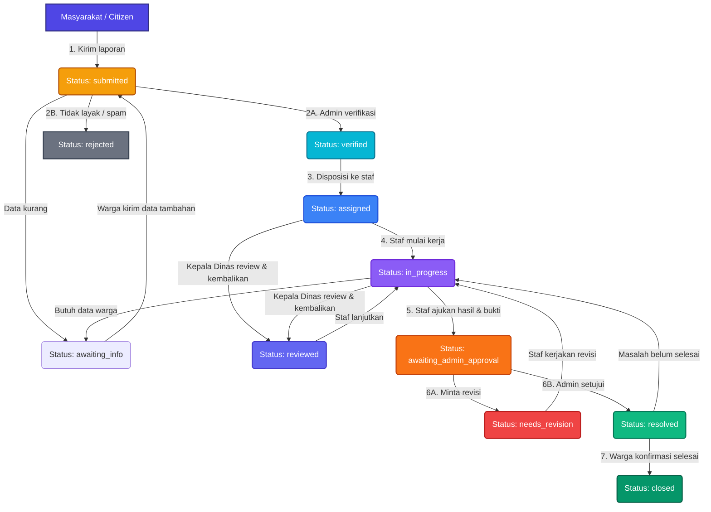
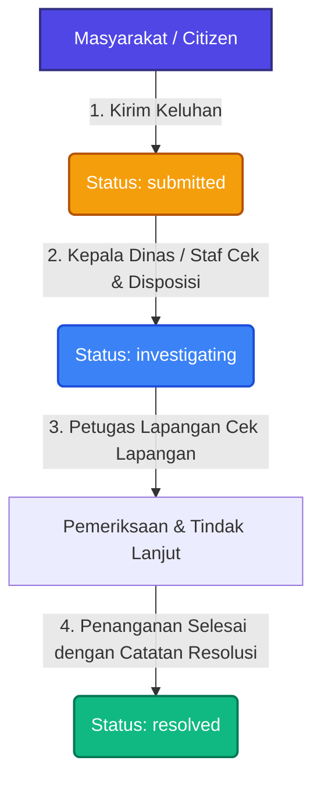
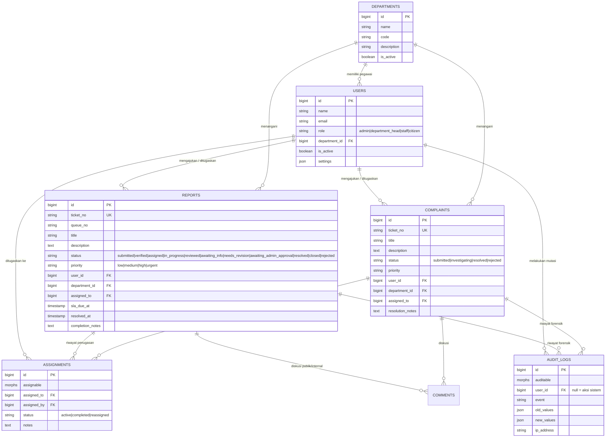

# ⚡ SynapseGov — Intelligent e-Government Public Report & Complaint System
### *Sistem Terpadu Penanganan Laporan & Aspirasi Masyarakat Berbasis e-Government dengan Penegakan SLA dan Isolasi Keamanan Multi-OPD*

[](https://laravel.com)
[](https://php.net)
[](#-arsitektur--alur-kerja-workflow-lifecycle)
[](#1-⏱️-automated-service-level-agreement-sla-engine)
[](#-fitur-unggulan--inovasi-teknologi)
[](LICENSE)

---

## 📌 Ringkasan Proyek

**SynapseGov** adalah platform tata kelola pemerintahan digital (*e-Government*) modern yang mentransformasikan penanganan laporan pengaduan infrastruktur, fasilitas umum, dan aspirasi pelayanan masyarakat secara terstruktur, transparan, akuntabel, dan terikat waktu (*Service Level Agreement / SLA-enforced*).

Dikembangkan secara khusus untuk **Lomba Web Development IT Days 2026 - Himpunan Mahasiswa Informatika (HMIF) Universitas Sanata Dharma** pada subtema **Pemerintahan Digital (*e-Government*)** dengan mengusung filosofi tema *"Mens et Corpus"* (keseimbangan antara kecerdasan logika otomasi sistem dan ketangguhan arsitektur keamanan data).

Aplikasi ini mengatasi kendala laten birokrasi pemerintahan konvensional: laporan yang terabaikan tanpa kepastian waktu, disposisi manual yang lambat, kerentanan kebocoran catatan rahasia internal ke publik, serta tumpang tindih kewenangan antar Organisasi Perangkat Daerah (OPD).

---

## 👥 Matriks Akun Demo untuk Pengujian Juri

Seeder (`php artisan migrate:fresh --seed`) membuat 5 OPD contoh dan akun untuk 4 peran (*Multi-Role Hierarchy*). Juri dan penguji dapat langsung masuk menggunakan akun-akun berikut:

| Peran (*Role*) | Email Akun | Kata Sandi (*Password*) | Lingkup Wewenang & Hak Akses |
|:---|:---|:---|:---|
| **Super Admin** | `admingg@gmail.com`<br>*(alt: `admin@government.gov`)* | `password`<br>*(alt: `admin123`)* | **Kontrol penuh sistem global**: memverifikasi kelayakan awal tiket masuk, menolak laporan spam/invalid, mengelola departemen/OPD, memantau analitik SLA kota, dan memberikan persetujuan penyelesaian akhir. |
| **Kepala Dinas (*Dept Head*)** | `departhead@gmail.com`<br>*(alt: `head.pwd@government.gov`)* | `password`<br>*(alt: `head123`)* | **Pimpinan Operasional OPD**: mengelola antrean tiket dinas terkait, mendisposisikan tiket ke staf lapangan, meninjau & mengembalikan pekerjaan staf (`reviewed` / `needs_revision`), merekomendasikan tiket selesai ke Admin, dan menyelesaikan keluhan masyarakat. |
| **Petugas Lapangan (*Staff*)** | `staff@gmail.com`<br>*(alt: `staff1.pwd@government.gov`)* | `password`<br>*(alt: `staff123`)* | **Pelaksana Teknis Lapangan**: menerima disposisi tugas, memulai pengerjaan (`in_progress`), meminta data tambahan warga (`awaiting_info`), mengunggah bukti penyelesaian lapangan, dan mengajukan hasil ke pimpinan. |
| **Masyarakat (*Citizen*)** | `usergg@gmail.com`<br>*(alt: `citizen1@example.com`)* | `password`<br>*(alt: `citizen123`)* | **Masyarakat Pelapor**: mengajukan laporan kerusakan fasilitas & keluhan pelayanan publik, memantau status tiket, melengkapi data saat diminta, serta mengonfirmasi penyelesaian atau membuka kembali tiket bila masalah belum tuntas. |

> **Penting untuk pengujian:** `departhead@gmail.com` dan `staff@gmail.com` bertugas di **Dinas Pekerjaan Umum dan Penataan Ruang**. Saat membuat laporan sebagai warga, pilih OPD tersebut agar laporan muncul di antrean kedua akun ini. Akun alternatif mengikuti pola `head.<kode>@government.gov` dan `staff<1-3>.<kode>@government.gov` dengan kode OPD `pwd`, `hd`, `ed`, `psd`, `env`.

---

## 🏛️ Arsitektur & Alur Kerja (*Workflow Lifecycle*)

Sistem mengadopsi prinsip pemisahan antara **Laporan Fisik/Infrastruktur (*Reports*)** dan **Keluhan/Aspirasi Layanan (*Complaints*)** dengan alur birokrasi terstruktur:

### 1. Alur Kerja Laporan Fasilitas & Infrastruktur (*Public Report Workflow*)

Setiap laporan publik melewati mesin status (*State Machine*) dengan 11 status. Aturan perpindahannya didefinisikan di **satu tempat**, yaitu konstanta `Report::STATUS_TRANSITIONS` di [`app/Models/Report.php`](app/Models/Report.php), dan ditegakkan otomatis setiap kali laporan disimpan. Perpindahan di luar aturan selalu ditolak, dari tombol atau endpoint mana pun ia dipicu.



#### Matriks Transisi Status Laporan:
| Status | Penanggung Jawab | Deskripsi Tahapan | Aksi Lanjutan yang Tersedia |
|:---|:---|:---|:---|
| `submitted` | Admin | Laporan baru masuk dan menunggu peninjauan awal. | Verifikasi (`verified`), Tolak (`rejected`), Minta Info (`awaiting_info`), atau langsung Disposisi (`assigned`). |
| `awaiting_info` | Masyarakat Pelapor | Petugas/admin memerlukan kejelasan alamat, foto, atau detail pendukung. | Pelapor mengirim data tambahan lewat form di halaman detail laporan, lalu tiket kembali ke `submitted` untuk diverifikasi ulang. |
| `verified` | Admin / Kepala Dinas | Laporan valid dan siap ditugaskan. | Disposisi ke staf/kepala dinas (`assigned`) atau Tolak (`rejected`). |
| `assigned` | Staf Lapangan | Tiket telah didelegasikan kepada petugas. | Mulai Kerjakan (`in_progress`), Minta Info (`awaiting_info`), Ajukan Hasil (`awaiting_admin_approval`), atau Review Kepala Dinas (`reviewed`). |
| `in_progress` | Staf Lapangan | Penanganan sedang berlangsung di lokasi. | Minta Info (`awaiting_info`), Ajukan Hasil & Bukti (`awaiting_admin_approval`), Alihkan Staf (`assigned`), atau Review Kepala Dinas (`reviewed`). |
| `reviewed` | Staf Lapangan | Kepala Dinas meninjau dan mengembalikan tiket dengan arahan tindak lanjut. | Staf melanjutkan (`in_progress`) atau mengajukan hasil (`awaiting_admin_approval`). |
| `awaiting_admin_approval` | Kepala Dinas & Admin | Pekerjaan diajukan tuntas oleh staf beserta catatan/bukti. | Kepala Dinas merekomendasikan ke Admin atau meminta revisi (`needs_revision`); Admin menyetujui (`resolved`) atau meminta revisi. |
| `needs_revision` | Staf Lapangan | Hasil kerja dinilai belum memenuhi standar. | Staf mengerjakan revisi (`in_progress`) lalu mengajukan kembali. |
| `resolved` | Admin → Masyarakat | Laporan dinyatakan tuntas oleh pemerintah. | Warga mengonfirmasi selesai (`closed`) atau menyatakan masalah belum selesai (kembali ke `in_progress`, maks. 30 hari). |
| `closed` | Masyarakat Pelapor | Siklus tiket berakhir dengan konfirmasi warga. | Tiket diarsipkan. |
| `rejected` | Admin | Laporan ditolak (spam, di luar kewenangan) disertai alasan. | Status akhir; tidak dapat diubah lagi. |

> Status `pending` dipakai sebagai penanda otomatis laporan yang dicurigai spam (`php artisan reports:check-spam`) dan diperlakukan sama seperti `submitted`.

---

### 2. Alur Kerja Pengaduan & Keluhan Layanan (*Complaint Workflow*)

Ditujukan untuk aspirasi atau keluhan tata kelola non-infrastruktur yang memerlukan penanganan cepat dan responsif:



---

## 🌟 Fitur Unggulan & Inovasi Teknologi

### 1. ⏱️ Automated Service Level Agreement (SLA) Engine
* Setiap tiket yang masuk secara otomatis dihitung tenggat waktunya (`sla_due_at`) berdasarkan tingkat urgensi:
  * **Urgent:** 2 Jam
  * **High:** 8 Jam
  * **Medium:** 24 Jam
  * **Low:** 72 Jam
* Scheduler Laravel (`php artisan schedule:work`) menjalankan `php artisan sla:check` **setiap 5 menit**. Tiket yang melewati tenggat (dan belum selesai/ditolak) ditandai `is_escalated`, prioritasnya dinaikkan ke *urgent* **tanpa memundurkan tenggat awal**, lalu event `SLABreached` mengirim notifikasi eskalasi ke Super Admin, Kepala Dinas terkait, dan petugas yang ditugaskan.
* Setiap eskalasi tercatat di audit log sebagai aksi sistem.

### 2. 🔐 Department Boundary Isolation (Proteksi Multi-OPD)
* Mengimplementasikan pembatasan akses data antar instansi (*multi-tenant departmental boundary*) di level Controller dan Model Policy (`ReportPolicy`).
* Petugas Lapangan (*Staff*) dan Kepala Dinas (*Department Head*) dari OPD tertentu (misal: Dinas PUPR) **dibatasi secara ketat dan tidak dapat mengintip, menyunting, maupun memanipulasi** data dinas lain (misal: Dinas Lingkungan Hidup).

### 3. 🔁 State Machine Terpusat & Anti-Bypass Alur
* Seluruh perpindahan status laporan diatur oleh satu tabel aturan, `Report::STATUS_TRANSITIONS`, yang dicek otomatis setiap kali laporan disimpan (model event `updating`).
* Akibatnya tidak ada jalan pintas: staf tidak bisa langsung menandai laporan selesai tanpa persetujuan admin, laporan yang sudah ditolak/ditutup tidak bisa dihidupkan kembali secara sembarangan, dan form edit admin hanya menawarkan status lanjutan yang sah.

### 4. 🛡️ Catatan Publik vs Internal & Perlindungan Data Pribadi
* Setiap komentar/catatan tiket memiliki penanda `is_internal`. Endpoint riwayat tiket (`/workflow/reports/{id}/history`) dan *event listener* notifikasi menyaring catatan internal sehingga **tidak pernah terlihat** oleh masyarakat pelapor.
* Data pribadi pengguna (NIK, nomor HP, alamat, tanggal lahir, jejak login) disembunyikan dari seluruh respons JSON. Warga hanya melihat linimasa tiket (siapa, kapan, apa), tanpa IP, *user-agent*, atau salinan data internal.

### 5. 📜 Forensic Audit Logging
* Setiap perubahan data penting (pergantian status tiket, penugasan staf, instruksi revisi, pengesahan, dan pengembalian berkas) direkam otomatis pada tabel `audit_logs` dengan menyimpan:
  * ID pengguna pelaku (atau `null` untuk aksi sistem seperti eskalasi SLA)
  * Nilai data sebelum (*old values*) & sesudah (*new values*)
  * Alamat IP & spesifikasi peramban (*User-Agent*), hanya dapat dilihat Admin
  * Stempel waktu (*timestamp*)

### 6. 🛡️ Strict Anti-Malware & File Upload Guard
* Middleware [`ValidateFileUpload`](app/Http/Middleware/ValidateFileUpload.php) memeriksa setiap berkas lampiran warga:
  * Memblokir ekstensi berbahaya (`.php`, `.phtml`, `.phar`, `.sh`, `.exe`, `.bat`, `.js`, `.svg`, `.html`, dll).
  * Menangkal teknik pemalsuan *double extension* (seperti `bukti.php.png`).
  * Memverifikasi MIME Type dari isi berkas di sisi server dan membatasi ukuran maksimal **5MB** per berkas.
* Lampiran disimpan di penyimpanan privat (`storage/app/attachments`), bukan di folder publik. Berkas hanya dapat dibuka melalui aplikasi setelah lolos pemeriksaan hak akses; akses langsung lewat URL `/storage/...` menghasilkan 404.

### 7. 📄 Tri-Format Document Export
* Dilengkapi generator dokumen terintegrasi:
  * **PDF:** Ringkasan laporan (detail tiket, status, prioritas, tenggat SLA) yang dibuat dengan *DomPDF*.
  * **Analitik CSV:** Ekspor data laporan untuk diolah di spreadsheet, dengan sanitasi *formula injection*.
  * **Paket Arsip ZIP:** Mengemas seluruh berkas lampiran beserta metadata terstruktur dalam format `report.json`.

### 8. 📊 Transparansi Publik & Lacak Tiket Tanpa Login
* **Dashboard kinerja OPD di halaman utama:** jumlah laporan, persentase laporan tuntas, dan persentase yang **selesai sebelum tenggat SLA**, per OPD maupun total kota. Angka dihitung otomatis dari data laporan (di-*cache* 1 menit).
* **Lacak tiket (`/lacak`):** siapa pun yang memegang nomor tiket dapat melihat status, tahapan (Diterima → Diverifikasi → Ditangani → Selesai), OPD tujuan, dan status SLA tanpa perlu masuk.
* **Privasi tetap terjaga:** judul, isi laporan, lokasi, lampiran, catatan petugas, dan identitas pelapor tidak pernah ditampilkan di halaman publik. Endpoint dibatasi 30 permintaan/menit per IP sehingga menebak nomor tiket tidak praktis.

### 9. 🌐 Pengalaman Pengguna (*Modern UX*)
* **Pilihan Bahasa ID/EN:** Menu navigasi dasbor dapat dialihkan ke Bahasa Inggris; konten dan pesan sistem menggunakan Bahasa Indonesia.
* **Mode Gelap / Terang (*Dark/Light Mode*):** Tampilan adaptif yang tersimpan otomatis di preferensi profil pengguna.
* **Responsive Layout & Mobile Drawer:** Navigasi responsif pada perangkat layar sentuh dengan penanganan *keyboard accessibility* (Escape key, backdrop auto-dismiss).
* **Waktu Lokal:** Seluruh waktu ditampilkan dalam WIB (`Asia/Jakarta`).
* **Pesan dalam Bahasa Indonesia:** pesan validasi form, login, dan paginasi tersedia dalam Bahasa Indonesia (`lang/id`).

---

## 🗄️ Diagram Relasi Data (*Entity Relationship Diagram / ERD*)



---

## 🎯 Panduan Skenario Pengujian Juri (*Step-by-Step Walkthrough*)

Untuk mempermudah dewan juri dalam memverifikasi keutuhan logika alur kerja secara langsung melalui peramban. Tombol aksi petugas ada di menu **Laporan Publik**, pada baris tiket (tombol **Tindak Lanjut** atau deretan tombol aksi). Tombol yang tampil selalu menyesuaikan status tiket dan peran pengguna.

### Skenario 1: Siklus Penuh Penanganan Laporan Warga (*Report Full Lifecycle*)
1. **Langkah 1 (Citizen):**
   * Masuk sebagai `usergg@gmail.com` / `password`.
   * Klik **"Buat Laporan Baru"**, pilih OPD **Dinas Pekerjaan Umum dan Penataan Ruang**, unggah foto bukti (JPG/PNG, maks. 5MB), lalu kirim.
   * Catat nomor tiket yang terbentuk (contoh: `RPT-20261001-AB12CD`). Status awal: **Baru masuk** (`submitted`).
2. **Langkah 2 (Super Admin):**
   * Masuk sebagai `admingg@gmail.com` / `password`.
   * Buka menu **Laporan Publik**, pada tiket tersebut pilih **"Verifikasi (Layak)"**. Status berpindah ke **Siap ditugaskan** (`verified`).
   * *Alternatif:* **"Minta Info Tambahan"** (warga melengkapi data dari halaman detail laporannya) atau **"Tolak (Tidak Layak)"** dengan alasan.
3. **Langkah 3 (Kepala Dinas):**
   * Masuk sebagai `departhead@gmail.com` / `password`.
   * Buka menu **Laporan Publik**, klik **"Disposisi ke Staf"**, pilih staf pelaksana (*Staff GG*), dan tambahkan instruksi pengerjaan. Status menjadi **Ditugaskan** (`assigned`).
4. **Langkah 4 (Staf Lapangan):**
   * Masuk sebagai `staff@gmail.com` / `password`.
   * Buka menu **Laporan Publik**, klik **"Mulai Kerjakan"**. Status berpindah ke **Dalam pengerjaan** (`in_progress`).
   * Setelah perbaikan selesai, klik **"Ajukan Hasil & Bukti"**, isi catatan hasil dan lampirkan foto pengerjaan. Status berpindah ke **Persetujuan admin** (`awaiting_admin_approval`).
5. **Langkah 5 (Review Kepala Dinas):**
   * Masuk kembali sebagai `departhead@gmail.com`.
   * Jika hasil belum memadai, tekan **"Minta Revisi Staf"**, lalu status menjadi **Perlu revisi** (`needs_revision`). Staf kemudian menekan **"Kerjakan Revisi"** dan mengajukan hasil kembali.
   * Jika pengerjaan sudah sesuai, tekan **"Rekomendasikan ke Admin"**.
6. **Langkah 6 (Persetujuan Admin Utama):**
   * Masuk sebagai `admingg@gmail.com`.
   * Buka tiket terkait, tinjau bukti penyelesaian, lalu pilih **"Setujui (Selesai)"**. Status resmi menjadi **Selesai** (`resolved`).
7. **Langkah 7 (Konfirmasi Warga):**
   * Masuk kembali sebagai `usergg@gmail.com`, buka menu **Laporan Saya**, lalu buka detail tiket.
   * Klik **"Ya, Masalah Selesai (Arsipkan)"**: status akhir menjadi **Ditutup** (`closed`). Jika masalah belum tuntas, klik **"Masalah Belum Selesai"** untuk mengembalikan tiket ke petugas.

> **Uji anti-bypass (opsional):** buka form edit laporan sebagai admin; dropdown status hanya menawarkan status lanjutan yang sah. Permintaan yang dimanipulasi di luar aturan akan ditolak dengan pesan *"Laporan berstatus ... tidak dapat diubah menjadi ..."*.

### Skenario 2: Penanganan Keluhan & Aspirasi (*Complaint Lifecycle*)
1. Masuk sebagai **Citizen** (`usergg@gmail.com`), buat keluhan melalui menu **Keluhan Saya** dengan OPD **Dinas Pekerjaan Umum dan Penataan Ruang**. Status: **Baru masuk** (`submitted`).
2. Masuk sebagai **Kepala Dinas** (`departhead@gmail.com`), buka menu **Keluhan & Aspirasi**, klik **"Lihat detail"**, lalu gunakan **"Tugaskan kepada staf"**. Status: **Dalam investigasi** (`investigating`).
3. Kepala Dinas menekan **"Selesaikan Keluhan"** dengan mengisi catatan resolusi resmi. Status akhir: **Selesai** (`resolved`).

### Skenario 3: Transparansi Publik (tanpa login)
1. Buka halaman utama, lalu gulir ke bagian **Transparansi**: statistik per OPD diperbarui otomatis (maks. 1 menit) setiap ada laporan yang diselesaikan.
2. Pada kartu **Lacak Tiket**, masukkan nomor tiket dari Skenario 1. Halaman `/lacak` menampilkan status, tahapan, dan status SLA, tanpa judul, isi laporan, maupun identitas pelapor.

---

## 💻 Panduan Instalasi & Menjalankan (*Quick Start*)

Konfigurasi bawaan memakai **SQLite**, jadi tidak perlu server database (MySQL/XAMPP). Server email juga tidak diperlukan: pada mode `local` pengiriman email dinonaktifkan, sedangkan notifikasi tetap tampil di dasbor.

### Prasyarat Sistem:
* **PHP:** Versi 8.2 atau 8.3
* **Composer:** Versi 2.x
* **Node.js:** Versi 18+ & NPM
* **Ekstensi PHP Aktif:** `pdo_sqlite`, `sqlite3`, `mbstring`, `openssl`, `fileinfo`, `gd`, `zip`, `dom`, `xml`, `xmlreader`, `xmlwriter`, `simplexml`, `iconv`, `zlib`, `ctype`, `tokenizer` (tambahkan `pdo_mysql` jika memakai MySQL).
  * Periksa dengan `php -m`. Di Windows (PHP/XAMPP), ekstensi seperti `gd`, `zip`, `fileinfo`, `pdo_sqlite`, dan `sqlite3` biasanya perlu diaktifkan dengan menghapus tanda `;` pada baris `extension=...` di `php.ini`. Tanpa `gd`, perintah `composer install` akan gagal.

### Langkah-Langkah Menjalankan:

1. **Clone Repositori:**
   ```bash
   git clone https://github.com/wilfrydo/SynapseGov-ITDays2026.git
   cd SynapseGov-ITDays2026
   ```

2. **Instalasi Dependensi PHP & JavaScript:**
   ```bash
   composer install
   npm install
   ```

3. **Konfigurasi Environment (`.env`):**
   ```bash
   cp .env.example .env
   php artisan key:generate
   ```
   *(Windows CMD: gunakan `copy .env.example .env`.)*

4. **Buat File Database SQLite** (perintah ini berjalan di Windows, macOS, maupun Linux):
   ```bash
   php -r "touch('database/database.sqlite');"
   ```

5. **Migrasi Database & Data Demo:**
   ```bash
   php artisan migrate:fresh --seed
   ```

6. **Symbolic Link Media Unggahan:**
   ```bash
   php artisan storage:link
   ```

7. **Kompilasi Aset Frontend:**
   ```bash
   npm run build
   ```

8. **Jalankan Server Lokal:**
   ```bash
   php artisan serve
   ```
   Akses aplikasi melalui peramban web di: `http://127.0.0.1:8000`

9. **(Opsional) Jalankan Scheduler untuk Eskalasi SLA Otomatis**, di terminal kedua:
   ```bash
   php artisan schedule:work
   ```
   Untuk menguji eskalasi secara langsung tanpa menunggu jadwal: `php artisan sla:check`.

### Memakai MySQL / MariaDB (opsional)
Buat database kosong (misal `synapsegov`), lalu di `.env` ganti `DB_CONNECTION=sqlite` dengan blok MySQL yang sudah disediakan (dalam bentuk komentar) di `.env.example`. Setelah itu jalankan langkah 5–8.

### Kendala Umum
| Gejala | Penyebab & Solusi |
|:---|:---|
| `could not find driver` | Ekstensi `pdo_sqlite` (atau `pdo_mysql`) belum aktif di `php.ini`. |
| `composer install` gagal: *requires ext-gd / ext-zip* | Aktifkan `extension=gd` / `extension=zip` di `php.ini`. |
| `Database file ... does not exist` | Jalankan langkah 4 (membuat `database/database.sqlite`). |
| `Vite manifest not found` | Jalankan `npm install` lalu `npm run build`. |
| Foto lampiran tidak tampil | Jalankan `php artisan storage:link`. |
| `storage:link` gagal di Windows (*error code 1314*) | Jalankan terminal sebagai Administrator atau aktifkan *Developer Mode* Windows, lalu ulangi. |

---

## 🧪 Pengujian Otomatis (*Automated Testing*)

```bash
php artisan test
```

Pengujian otomatis memakai database SQLite *in-memory* (tidak menyentuh data demo) dan mencakup:
* **Smoke test:** halaman utama (beserta statistik transparansi) dapat diakses.
* **State machine** (`tests/Feature/ReportWorkflowTest.php`): perpindahan status yang sah tersimpan, sedangkan perpindahan di luar aturan (misal `closed` → `verified`) ditolak dengan `InvalidStatusTransition`.
* **Lacak tiket publik:** status tampil tanpa membocorkan judul laporan, dan format nomor tiket yang salah ditolak.

Alur lengkap antar-peran (disposisi, revisi, persetujuan, isolasi antar-OPD) diuji secara manual melalui **Panduan Skenario Pengujian Juri** di atas.

---

## 📁 Struktur Direktori Utama

```text
├── app/
│   ├── Console/Commands/       # Perintah terjadwal (SLA checker, deteksi spam, file cleanup)
│   ├── Events/                 # Event-Driven Architecture (ReportStatusChanged, SLABreached)
│   ├── Exceptions/             # InvalidStatusTransition (penolakan perpindahan status ilegal)
│   ├── Http/
│   │   ├── Controllers/        # Admin, Administration (OPD), Citizen, Workflow, PublicTransparency
│   │   └── Middleware/         # Anti-Malware File Guard, AdministrationAccess, Rate Limiter
│   ├── Listeners/              # Notifikasi terfilter (email & dasbor)
│   ├── Models/                 # Report (STATUS_TRANSITIONS), Complaint, Department, Assignment, AuditLog, Comment
│   ├── Policies/               # Isolasi Otorisasi Departemen (ReportPolicy, ComplaintPolicy)
│   └── Services/               # WorkflowService (logika alur & penugasan)
├── database/
│   ├── migrations/             # Skema tabel basis data dengan foreign key & indexing
│   └── seeders/                # 5 OPD contoh & akun demo 4 peran
├── lang/id/                    # Pesan validasi, login, dan paginasi Bahasa Indonesia
├── public/
│   ├── css/                    # Desain responsif, navigasi mobile, dark-mode, landing & transparansi
│   └── js/                     # Interaktivitas UI, mobile drawer, modal handler
├── resources/
│   └── views/
│       ├── admin/              # Dasbor & manajemen Super Admin
│       ├── administration/     # Dasbor operasional Kepala Dinas & Staf Lapangan
│       ├── citizen/            # Portal layanan & pengajuan masyarakat
│       ├── public/             # Halaman lacak tiket tanpa login
│       ├── components/         # Komponen modular (workflow-buttons, modal aksi)
│       └── layouts/            # Master layout adaptif (pilihan bahasa navigasi & mode gelap/terang)
├── routes/
│   ├── web.php                 # Rute terproteksi middleware otentikasi & hak akses peran
│   └── api.php                 # Endpoint API
└── README.md                   # Dokumentasi teknis & operasional
```

---

## 📄 Lisensi & Tim Pengembang

Karya ini dikembangkan dengan penuh integritas dan komitmen keunggulan teknis untuk **Lomba Web Development IT Days 2026 — Himpunan Mahasiswa Informatika (HMIF) Universitas Sanata Dharma, Yogyakarta**.

* **Subtema:** Pemerintahan Digital (*e-Government*)
* **Tema Filosofis:** *"Mens et Corpus"*
* **Hak Cipta:** © 2026 SynapseGov Team. Lisensi di bawah [MIT License](LICENSE).
