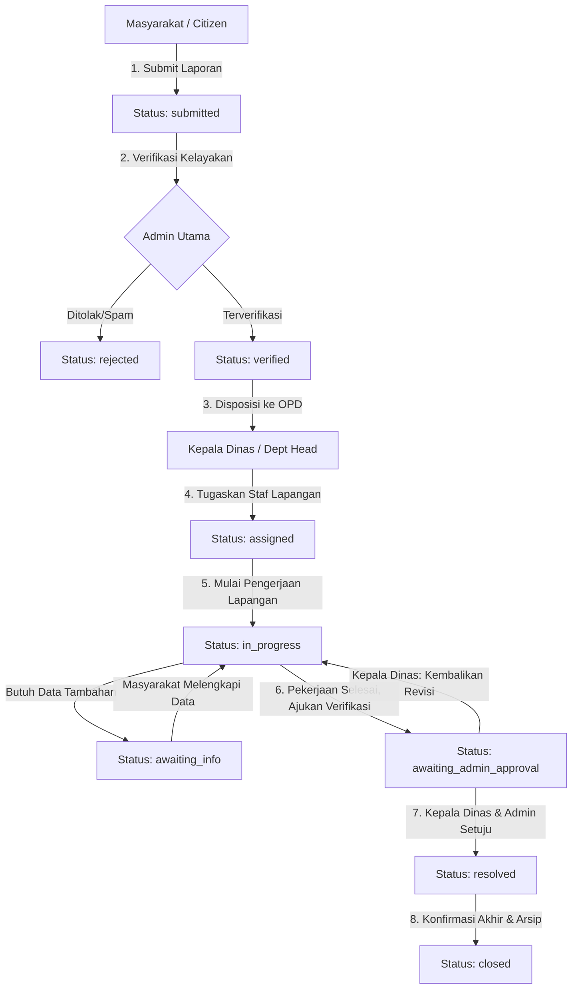

# ⚡ SynapseGov — Intelligent e-Government Public Report & Complaint System
### *Sistem Terpadu Penanganan Laporan & Aspirasi Masyarakat Berbasis e-Government*

[](https://laravel.com)
[](https://php.net)
[-success?style=for-the-badge&logo=github-actions&logoColor=white)](#-pengujian-otomatis-automated-testing)
[-blue?style=for-the-badge&logo=codefactor&logoColor=white)](#)
[](#-fitur-keamanan-tinggi-security-architecture)
[](LICENSE)

---

## 📌 Ringkasan Proyek

**SynapseGov** adalah platform tata kelola pemerintahan digital (*e-Government*) modern yang dibangun untuk mentransformasikan penanganan laporan, pengaduan, dan aspirasi masyarakat secara transparan, akuntabel, dan terikat waktu (*SLA-enforced*). 

Dikembangkan secara khusus untuk **Lomba Web Development IT Days 2026 - Himpunan Mahasiswa Informatika (HMIF) Universitas Sanata Dharma** di bawah subtema **Pemerintahan Digital (*e-Government*)** dengan mengusung filosofi tema *"Mens et Corpus"* (keseimbangan antara kecerdasan logika otomasi sistem dan ketangguhan arsitektur keamanan data).

---

## 🌟 Fitur Utama & Aspek Inovasi

### 1. ⏱️ Automated Service Level Agreement (SLA) Engine
* Setiap laporan dan keluhan yang masuk memiliki batas waktu penyelesaian (*SLA timestamp*).
* Sistem otomasi (`CheckSLA`) secara berkala memantau keterlambatan penanganan laporan. Apabila melewati batas SLA, sistem otomatis memicu event `SLABreached` dan mengirimkan notifikasi eskalasi tingkat tinggi kepada Kepala Dinas dan Administrator.

### 2. 🔐 Department Boundary Isolation (Proteksi Batas OPD)
* Mengimplementasikan pembatasan akses data (*multi-tenant departmental boundary*) di level Controller dan Model Policy (`ReportPolicy`).
* Petugas Lapangan (*Staff*) dan Kepala Dinas (*Department Head*) dari suatu Organisasi Perangkat Daerah (OPD) **tidak dapat mengintip, memodifikasi, ataupun menghapus** laporan dari OPD lain.

### 3. 🛡️ Dual-Channel Comment & Internal Privacy
* Kolom catatan/komentar dilengkapi proteksi privasi bertingkat:
  * **Komentar Publik:** Dapat dilihat oleh masyarakat pelapor untuk transparansi progres.
  * **Komentar Internal Kedinasan (`is_internal = true`):** Khusus koordinasi rahasia antar staf/pimpinan dinas. Event listener otomatis memfilter notifikasi sehingga catatan internal **tidak pernah bocor** ke notifikasi masyarakat.

### 4. 📜 Immutable Forensic Audit Logging
* Setiap mutasi tiket (pengajuan, verifikasi, penugasan staf, pengembalian revisi, penyelesaian, hingga penutupan) dicatat secara kekal di tabel `audit_logs` lengkap dengan ID aktor, status lama, status baru, catatan, dan stempel waktu forensik.

### 5. 🛡️ Strict Anti-Malware & File Upload Guard
* Middleware [`ValidateFileUpload`](app/Http/Middleware/ValidateFileUpload.php) memvalidasi berkas unggahan:
  * Memblokir ekstensi berbahaya (`.php`, `.phtml`, `.phar`, `.sh`, `.exe`, dll).
  * Mencegah serangan *double extension* (contoh: `bukti.php.jpg`).
  * Memverifikasi keaslian MIME Type dan membatasi ukuran berkas maksimal 10MB.

### 6. 🌐 Bilingual Engine (ID/EN) & Dark/Light Mode
* Pengalaman pengguna inklusif dengan dukungan multi-bahasa dinamis (Bahasa Indonesia dan Bahasa Inggris) serta mode tampilan Gelap/Terang (*Dark/Light Mode*) yang tersimpan dalam preferensi profil pengguna.

### 7. 📊 Ekspor Laporan & Statistik Terpadu
* Dilengkapi mesin unduh laporan resmi dalam format **PDF berstempel**, **CSV analitik**, serta pengarsipan **ZIP** berkas lampiran pendukung.

---

## 🏛️ Arsitektur & Alur Kerja (*Workflow Lifecycle*)

Sistem menerapkan mesin status (*State Machine*) 4-tingkat yang mengikat seluruh alur disposisi birokrasi pemerintahan:



---

## 👥 Matriks Akun Demo untuk Pengujian Juri

Aplikasi telah dilengkapi seeder data lengkap dengan skenario peran (*Multi-Role Hierarchy*). Gunakan akun-akun berikut untuk menguji sistem:

| Peran (*Role*) | Email Akun | Kata Sandi (*Password*) | Lingkup Wewenang & Hak Akses |
|:---|:---|:---|:---|
| **Super Admin** | `admingg@gmail.com` *(atau `admin@government.gov`)* | `password` *(atau `admin123`)* | Kontrol penuh sistem, manajemen departemen/OPD, verifikasi awal laporan masuk, audit log global, monitoring SLA. |
| **Kepala Dinas (*Dept Head*)** | `departhead@gmail.com` *(atau `head.pw@government.gov`)* | `password` *(atau `head123`)* | Mengelola seluruh aduan di dinasnya, mendisposisikan tugas ke staf, meninjau hasil kerja, menyetujui pengajuan penyelesaian ke Admin. |
| **Petugas Lapangan (*Staff*)** | `staff@gmail.com` *(atau `staff1.pw@government.gov`)* | `password` *(atau `staff123`)* | Menangani tiket tugas yang diberikan, mengubah status pengerjaan, mengunggah bukti penyelesaian, koordinasi internal. |
| **Masyarakat (*Citizen*)** | `usergg@gmail.com` *(atau `citizen1@example.com`)* | `password` *(atau `citizen123`)* | Mengajukan laporan/keluhan publik, memantau riwayat tracking tiket secara real-time, memberi tanggapan publik. |

---

## 🧪 Pengujian Otomatis (*Automated Testing*)

Proyek ini menerapkan prinsip rekayasa perangkat lunak modern dengan pengujian otomatis (*Automated Feature & Policy Tests*) menggunakan **PHPUnit** dan standar kode **Laravel Pint**.

```bash
# Menjalankan seluruh rangkaian automated tests
php vendor/bin/phpunit
```

### Hasil Uji Terakhir:
```text
PHPUnit 10.5.58 by Sebastian Bergmann and contributors.
Runtime:       PHP 8.3.0
Configuration: phpunit.xml

........                                                            8 / 8 (100%)

Time: 00:02.383, Memory: 46.00 MB
OK (8 tests, 15 assertions)
```

**Cakupan Uji Inti:**
1. ✅ **Comment Privacy Guard:** Memastikan komentar internal dinas tidak pernah memicu email/notifikasi ke warga pelapor.
2. ✅ **Department Isolation Guard:** Memastikan staf OPD lain menerima respon `403 Forbidden` saat mencoba mengakses atau memanipulasi aduan dinas lain.
3. ✅ **File Security Filter:** Memvalidasi penolakan otomatis terhadap unggahan skrip berbahaya (`.php`, `.sh`, dll).
4. ✅ **SLA Breach Trigger:** Memverifikasi pengiriman notifikasi eskalasi ketika waktu penanganan melampaui batas SLA.
5. ✅ **Workflow State Transition:** Memastikan alur verifikasi berjalan sesuai aturan State Machine.

---

## 💻 Panduan Instalasi & Menjalankan Sistem (*Quick Start*)

### Prasyarat Sistem:
* PHP >= 8.1 (Disarankan PHP 8.2 atau 8.3)
* Composer
* Node.js & NPM
* Ekstensi PHP: `pdo_sqlite` / `pdo_mysql`, `mbstring`, `openssl`, `tokenizer`, `xml`, `ctype`, `json`, `fileinfo`

### Langkah-Langkah:

1. **Clone Repository:**
   ```bash
   git clone https://github.com/AM4517UMOR4NG/SynapseGov.git
   cd SynapseGov
   ```

2. **Instal Dependensi:**
   ```bash
   composer install
   npm install
   ```

3. **Konfigurasi Lingkungan (`.env`):**
   ```bash
   cp .env.example .env
   php artisan key:generate
   ```

4. **Migrasi Database & Seeder Data:**
   ```bash
   php artisan migrate --seed
   ```

5. **Build Aset Frontend:**
   ```bash
   npm run build
   ```

6. **Jalankan Server Lokal:**
   ```bash
   php artisan serve
   ```
   Akses aplikasi pada peramban web di: `http://127.0.0.1:8000`

---

## 📁 Struktur Direktori Utama

```text
├── app/
│   ├── Console/Commands/       # Cron check SLA & sanitasi berkas sementara
│   ├── Events/                 # Event-driven architecture (SLA, Status, Comment)
│   ├── Http/
│   │   ├── Controllers/        # Admin, Administration (OPD), Citizen, Workflow
│   │   └── Middleware/         # Anti-Malware File Guard, Role Auth, Rate Limiter
│   ├── Listeners/              # Notifikasi tersaring & audit logger
│   ├── Models/                 # Report, Complaint, Department, AuditLog, Assignment
│   ├── Policies/               # Otorisasi ketat boundary departemen (ReportPolicy)
│   └── Services/               # WorkflowService (State Machine Logic)
├── database/
│   ├── migrations/             # Skema basis data terstruktur & indeks performa
│   └── seeders/                # Data seeder akun demo multi-role
├── resources/
│   ├── views/
│   │   ├── admin/              # Tampilan Super Admin
│   │   ├── administration/     # Tampilan Kepala Dinas & Staf OPD
│   │   ├── citizen/            # Portal Layanan Aspirasi Warga
│   │   └── layouts/            # Master Unified Layout (Dark/Light + Bilingual)
├── tests/
│   └── Feature/                # Automated Feature & Security Test Suite
└── README.md                   # Dokumentasi teknis sistem
```

---

## 📄 Lisensi & Tim Pengembang
Dikembangkan dengan penuh dedikasi untuk **IT Days 2026 Universitas Sanata Dharma**.  
Hak Cipta © 2026. Lisensi di bawah [MIT License](LICENSE).
